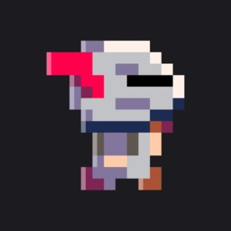

# Gemini Battle Simulation



## Overview

The Gemini Battle Simulation is a strategy-based game where players control battalions in tactical battles. The project is built with C++ and Raylib for backend logic and features a frontend developed with modern web technologies, hosted on Vercel.

## Features

- **Dynamic Battalion Management**
- **AI Interaction**
- **Environmental Interaction**
- **Web Deployment**

## Getting Started

### Prerequisites

- **Raylib**
- **Emscripten**

### Installation

1. **Clone the Repository**
   ```bash
   git clone https://github.com/erga-labs/gemini-battle-sim.git
   cd gemini-battle-sim
   ```

2. **Set Up Raylib**
   Add Raylib headers and library files to the external folder.

3. **Build the Project**
   ```bash
   make
   ```

4. **Run the Server**
   ```bash
   python -m http.server
   ```

## Frontend

The frontend for this simulation is hosted [here](https://github.com/TejasBhovad/battlesim-frontend) and deployed on Vercel at [aibattles.vercel.app](https://aibattles.vercel.app/).

## Usage

### Compiling and Running

Use `make` to compile the project and run a local server to access the game in a browser.


## File Structure

- **src/**: Source code.
- **assets/**: Game assets.
- **Makefile**: Build script.

## Contributing

Fork the repository and submit pull requests.
